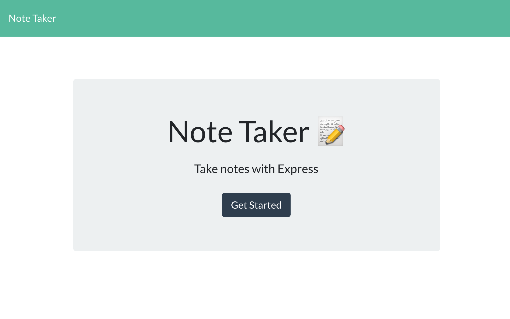
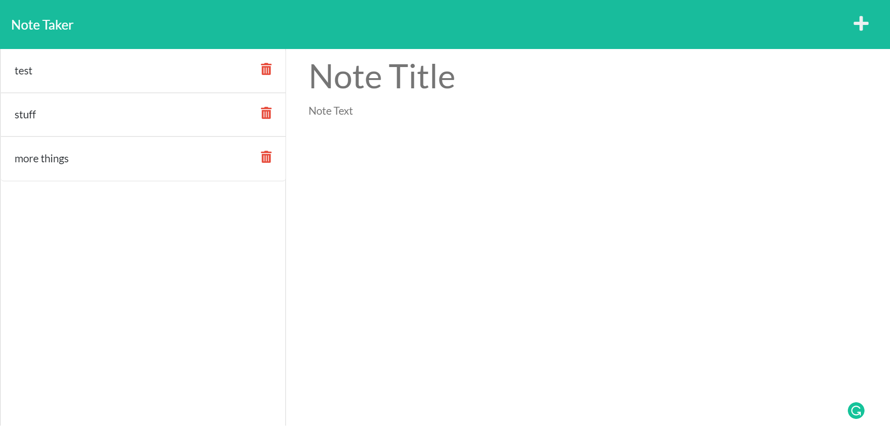

# Note Taker

## Description

This application uses an express backend and save and retrieve note data from a JSON file.

## User Story

```
AS A small business owner
I WANT to be able to write and save notes
SO THAT I can organize my thoughts and keep track of tasks I need to complete
```

## Installation Instructions

```
npm i, npm i express, npm i fs
```

### Screenshots of App

</img>
</img>